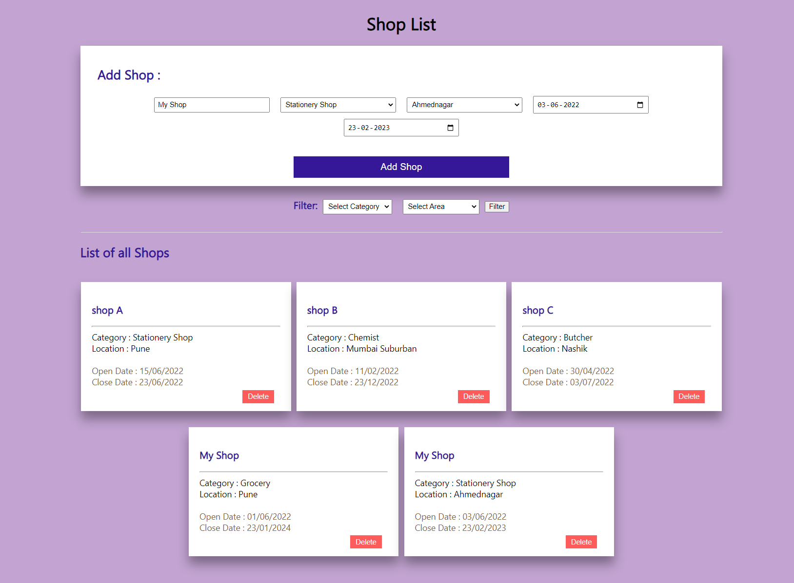
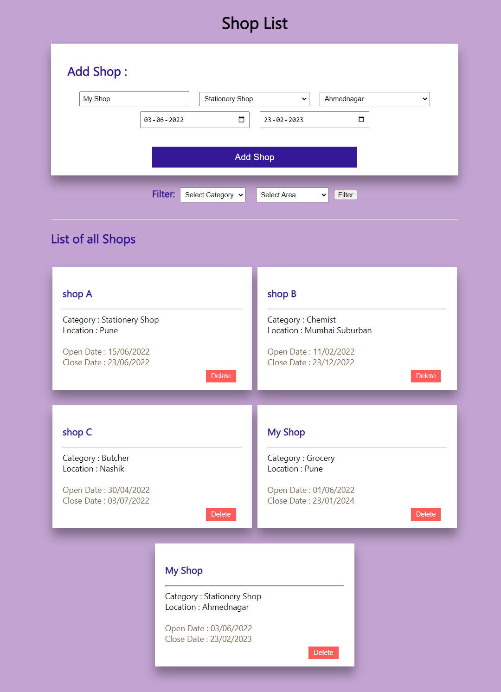
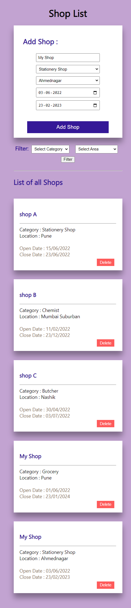

# Getting Started with fyntune.

This project can be previewed at 👉 [React Redux Shop App](https://fyn-tune.vercel.app/).

## Responsiveness
### Large Screens:

### Tablet Screens:

### Mobile Screens:

## Functionality:
- You can add a shop with its name, area & category, opening & closing date of the shop.
- You can see the list of shops.
-  You can filter the shops based on:
   - Category (Grocery, Butcher, Baker, Chemist, Stationery Shop)
   - Area (Thane, Pune, Mumbai Suburban, Nashik, Nagpur, Ahmednagar, Solapur)
 - All of the below mentioned validations are there, if the inputs fail to meet the validations the add shop button can not be clicked hence the shop will not be added.
   - Shop name: Only alphabet, required.
   - Area: Dropdown, Required.
   - Category: Dropdown, Required.
   - Opening Date: Date, Required.
   - Closing Date: Date, Required, should be after opening date.
 - You can delete shop from the list.
 - App is fully responsive.
